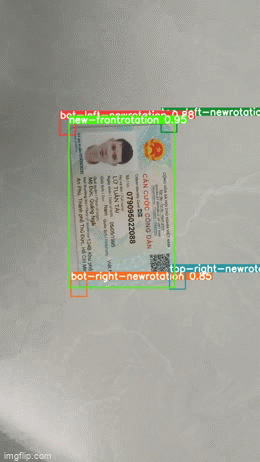

# Flask RESTful API for Machine Learning Services

This project support to deploy model and call API from predicted results for Machine Learning Services

## Deploy services (Apps, Postgres)

Start the server.

```bash
$ sudo docker-compose build
$ sudo docker-compose up -d
Flask server listening on http://localhost:3000
```

## Init database

```bash
docker exec -it cv-service-demo /bin/sh
psql -U admin
CREATE DATABASE <database_name>;
```

## Init app
```
docker exec -it cv-service-demo /bin/sh
export FLASK_APP=server.py
flask db init
flask db migrate
flask db upgrade
flask seed run
````

## Sample - This is a project that extract info of vietnamese id card (CCCD/CMND)

### Uploaded images through API (http://localhost:3000/id-card-ocr)


### Results

```
"message": "Extract infos successfully!",
"type": "new-front",
"infos": {
    "id": "001084008490",
    "name": "ĐỖ VĂN ĐỨC",
    "birth": "19/08/1984",
    "place_origin": "Xuân Giang, Sóc Sơn, Hà Nội",
    "place_residential": "Xuân Tảo, Xuân Giang, Sóc Sơn, Hà Nội"
}
```
### Sample - Predicting id card on videos
